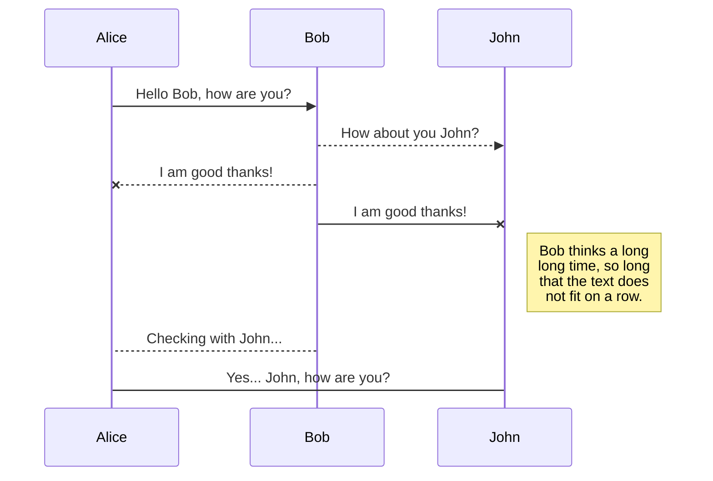
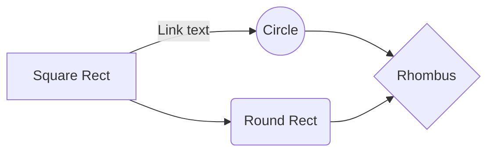

#  Protección del medio ambiente.
##  Índice:

1.- **Introducción**
2.- **Normativa vigente en Andalucía.**
3.-** Sustancias contaminantes en un ordenador**.
4.-** Normas para reducir el impacto ambiental de la informática**.
5.-** Reciclado.**

#  
#  indice

La **informática** y el uso de dispositivos electrónicos tiene un impacto directo en el medio ambiente, principalmente debido a los **residuos electrónicos**. Estos residuos, si no son gestionados adecuadamente, pueden liberar materiales tóxicos y contaminantes, como metales pesados, al medioambiente. El reciclaje y la correcta gestión de estos componentes es clave para mitigar este impacto.

1.- Los componentes electrónicos no se pueden reciclar.
2.- En un punto limpio o bien en el propio establecimiento donde hicimos la compra.
3.- Sólo es posible reciclar el embalaje del dispositivo y los vidrios que tuvieran (contenedor verde).
#  
#  Normativa vigente en andalucia

En Andalucía, la protección ambiental está regulada por varias leyes y directivas tanto a nivel nacional como regional. Entre ellas destaca la **Ley 7/2007**, de 9 de julio, de Gestión Integrada de la Calidad Ambiental, que establece que las actividades profesionales deben adoptar medidas preventivas para evitar daños ambientales. Además, los fabricantes y distribuidores de equipos electrónicos tienen la responsabilidad de hacerse cargo del reciclaje de los dispositivos una vez lleguen al final de su vida útil, lo que se debe hacer a través de **puntos limpios** o centros de reciclaje específicos.

#  
#  Sustancias contaminantes en un ordenador

**UN ORDENADOR PUEDE LLEGAR A CONTENER MAS DE 50COMPUESTOS TOXICOS**

los aparatos electronicos solo es  reutilizable un 25% de los componentes , un 72% son materiales reciclables(plasticos,metales ferrosos,aluminio,etc)y un 3% de elementos  potencialmente peligrosos :

1 **fosforo**: utilizado en recubrimientos en pantallas ,produce daños a organos
2 **cromo**: protecctor de  corrosion,produce daño genetico y bronquitis asmatica
3 **berilio**: utilizado para proteger de la radiacion,daños a organos 
4 **plomo**: utilizado en pantallas de crt y en la malloria de soldaduras ,daños en el riñon

#  Normas para reducir el impacto ambiental de la informática.

### **1. Optimización de los Equipos**
las formas más efectivas de reducir el impacto ambiental es **optimizar los equipos** existentes es prolongar la vida útil de los dispositivos, reduciendo así la necesidad de producción y desecho prematuro de equipos electrónicos.
-   **Mantenimiento regular**: Mantener los dispositivos informáticos en buen estado a través de actualizaciones periódicas de software, eliminación de archivos temporales y desfragmentación de discos puede mejorar la eficiencia operativa
    
-   **Reparación en lugar de reemplazo**: Promover una cultura de reparación en lugar de reemplazo puede reducir significativamente la cantidad de desechos electrónicos generados. En lugar de descartar equipos dañados, se puede optar por repararlos o actualizar sus componentes, como la memoria RAM o el disco duro.

### **2. Uso Responsable de la Energía**

-   **Apagar los equipos cuando no estén en uso**: Aunque puede parecer obvio, muchos dispositivos permanecen encendidos durante períodos largos sin ser utilizados, lo que aumenta el consumo energético innecesario. 
    
-   **Uso de configuraciones de ahorro energético**: Configurar los equipos para que entren en **modo de suspensión** o **modo ahorro de energía** 
    
-   **Compra de dispositivos de bajo consumo**: Al adquirir equipos informáticos, es importante optar por aquellos que cuenten con **certificaciones de eficiencia energética**, como el sello **Energy Star**. Estos dispositivos están diseñados para consumir menos energía

### **3. Reciclaje y Reutilización de Componentes**

El reciclaje es una parte fundamental de cualquier estrategia para reducir el impacto ambiental de la informática. Muchos de los componentes electrónicos, como metales, plásticos y vidrio, pueden ser reciclados y reutilizados. si no se gestionan adecuadamente, estos materiales pueden liberar sustancias tóxicas que contaminan el medio ambiente

-   **Reciclaje de dispositivos electrónicos**: Cuando un equipo informático ya no puede ser utilizado, debe ser reciclado adecuadamente. **Los puntos limpios** o **centros de reciclaje** son lugares donde se puede llevar este tipo de residuos electrónicos para su procesamiento.
    
-   **Reciclaje de consumibles**: Los consumibles como **toners** y **cartuchos de tinta**, **baterías** y **pilas** deben ser reciclados correctamente,  El reciclaje de estos consumibles no solo reduce la contaminación, sino que también puede ahorrar materiales valiosos al reutilizarlos para producir nuevos cartuchos o pilas.
    
-   **Reciclaje dey pantallas**: Aunque los monitores CRT están siendo reemplazados por pantallas LCD, los monitores CRT todavía contienen **plomo**, que puede ser perjudicial si no se trata adecuadamente. Estos deben ser reciclados en centros especializados para evitar la contaminación.
    
-   **Reutilización de componentes**: Algunos dispositivos informáticos antiguos pueden seguir siendo útiles en otras funciones. Las **piezas de repuesto**, como discos duros, memoria RAM o fuentes de alimentación, pueden ser reutilizadas o recicladas para darles una segunda vida en otros sistemas.

### **4. Impresión Responsable**

La impresión en entornos informáticos genera una gran cantidad de residuos, principalmente en forma de **papel** y **tóner**. Implementar normas para reducir la impresión y hacer un uso responsable del papel es esencial.

-   **Fomentar la digitalización**: El uso de **formatos digitales** puede reducir significativamente la cantidad de papel consumido. Usar documentos electrónicos, correos electrónicos y plataformas de colaboración en línea para compartir información en lugar de imprimirla reduce tanto el consumo de papel como la cantidad de tinta o tóner necesario.
    
-   **Imprimir solo cuando sea necesario**: Promover la **impresión a doble cara** y configurar las impresoras para que no imprima innecesariamente puede ahorrar una cantidad considerable de papel. También se pueden establecer límites sobre la cantidad de impresiones permitidas, especialmente en oficinas.
    
-   **Reciclaje de papel y consumibles**: Implementar políticas de reciclaje de **papel** y **cartuchos de tinta** en las oficinas para garantizar que estos materiales sean correctamente gestionados y no terminen en vertederos.
    

### **5. Cumplimiento de Normativas Ambientales**

Existen diversas normativas que regulan la fabricación, uso y reciclaje de productos electrónicos, y las empresas deben cumplir con ellas para minimizar su impacto ambiental.

-   **Directiva RoHS (Restriction of Hazardous Substances)**: Limita el uso de materiales peligrosos como plomo, mercurio, cadmio y cromo hexavalente en la fabricación de dispositivos electrónicos.
    
-   **Directiva WEEE (Waste Electrical and Electronic Equipment)**: Establece la recogida y reciclaje de equipos eléctricos y electrónicos, exigiendo a los fabricantes que se hagan responsables de la gestión de los residuos generados por los productos que comercializan.
    
-   **Reglamento REACH**: Regula la fabricación y uso de sustancias químicas, con el objetivo de proteger la salud humana y el medio ambiente, exigiendo a las empresas que registren y gestionen las sustancias químicas utilizadas en la fabricación de productos electrónicos.
    

# **Reciclaje de Aparatos Informáticos: Un Enfoque Integral**

El reciclaje de dispositivos electrónicos, o gestión de residuos electrónicos (*e-waste*), es una necesidad urgente para abordar los problemas ambientales y sociales derivados del rápido crecimiento de la industria tecnológica. Cada dispositivo desechado representa una oportunidad para recuperar recursos valiosos, reducir la contaminación y fomentar una economía circular más sostenible.

---

## **1. Introducción al Problema**

La producción masiva de dispositivos electrónicos y su rápido ciclo de obsolescencia han generado un aumento exponencial de residuos electrónicos.  
En 2021, se produjeron más de **53 millones de toneladas de *e-waste*** a nivel mundial, con una tasa de reciclaje de solo el 17%. Esto implica que una gran cantidad de residuos electrónicos acaba en vertederos, liberando sustancias tóxicas al medio ambiente.

### **Impacto Ambiental**
- **Contaminación del suelo y agua**: Sustancias como plomo, mercurio y cadmio pueden filtrarse al medio ambiente, afectando ecosistemas y recursos hídricos.  
- **Generación de gases de efecto invernadero**: El tratamiento incorrecto de plásticos y otros materiales contribuye al calentamiento global.

### **Impacto en la Salud Humana**
- **Exposición a metales pesados**: Las personas que trabajan en el manejo inadecuado de estos residuos corren el riesgo de desarrollar enfermedades respiratorias, problemas neurológicos y daños en órganos internos.

---

## **2. Importancia del Reciclaje de Aparatos Informáticos**

### **Recuperación de Recursos Valiosos**
- **Metales preciosos**: Oro, plata, paladio y cobre pueden ser recuperados y reutilizados.  
- **Plásticos y vidrios**: Pueden reciclarse para fabricar nuevos dispositivos, embalajes u otros productos.

### **Conservación de Recursos Naturales**
El reciclaje reduce la necesidad de extraer materiales vírgenes, disminuyendo el impacto ambiental asociado a la minería.

### **Promoción de la Economía Circular**
Reutilizar, reciclar y rediseñar dispositivos fomenta un modelo económico más sostenible, donde los materiales se mantienen en uso el mayor tiempo posible.

---

## **3. Métodos de Reciclaje de Dispositivos Informáticos**

### **Recolección y Clasificación**
- **Centros de Reciclaje**: Puntos limpios donde los consumidores pueden depositar dispositivos en desuso.  
- **Programas de Recompra**: Incentivos como descuentos en futuras compras por devolver equipos viejos.  
- **Campañas de Concienciación**: Informar sobre la importancia de reciclar correctamente.  

### **Desmantelamiento**
- Separación de componentes reutilizables como discos duros, carcasas y fuentes de alimentación.  
- Clasificación de materiales reciclables como plásticos, metales y vidrio.  

### **Procesamiento Especializado**
- **Extracción de Materiales**: Recuperación de metales preciosos y trituración mecánica de materiales.  
- **Tratamiento de Residuos Tóxicos**: Gestión segura de baterías y pantallas CRT.  

### **Reutilización**
- **Reparación y actualización**: Prolongar la vida útil de equipos.  
- **Donación**: Dispositivos funcionales pueden destinarse a escuelas o programas comunitarios.

---

## **4. Normas para Reducir el Impacto Ambiental**

### **Optimización de Equipos**
- Mantenimiento regular para prolongar la vida útil.  
- Reparación y actualización de componentes en lugar de reemplazo.  

### **Uso Responsable de Energía**
- Apagar equipos cuando no estén en uso.  
- Usar configuraciones de ahorro energético.  
- Adquirir dispositivos con certificaciones como *Energy Star*.  

### **Reciclaje y Reutilización**
- Gestión adecuada de consumibles como cartuchos y baterías.  
- Reutilización de piezas como discos duros, RAM y fuentes de alimentación.  

### **Impresión Responsable**
- Fomentar la digitalización para reducir el consumo de papel.  
- Implementar políticas de impresión a doble cara y reciclaje de papel y tóner.  

### **Cumplimiento de Normativas Ambientales**
- **Directiva RoHS**: Limita el uso de materiales peligrosos.  
- **Directiva WEEE**: Regula la recogida y reciclaje de dispositivos electrónicos.  
- **Reglamento REACH**: Controla el uso de sustancias químicas para proteger el medio ambiente.  

---

## **5. Beneficios del Reciclaje de Aparatos Informáticos**

### **Impacto Ambiental Positivo**
- Reducción de la contaminación del suelo, agua y aire.  
- Conservación de recursos naturales.  

### **Impacto Económico**
- Generación de empleos en la industria del reciclaje.  
- Ahorro de recursos al reutilizar materiales valiosos.  

### **Impacto Social**
- Reducción de la brecha digital mediante la reutilización de dispositivos en comunidades desfavorecidas.  

---

## **6. Desafíos en la Implementación del Reciclaje**

### **Falta de Infraestructura Adecuada**
Muchas regiones carecen de instalaciones especializadas para el tratamiento de residuos electrónicos.  

### **Escasa Concienciación**
Los consumidores desconocen cómo y dónde reciclar dispositivos.  

### **Costos de Procesamiento**
El reciclaje puede ser caro, especialmente al tratar materiales peligrosos.  

### **Gestión de Materiales Peligrosos**
El manejo inadecuado de baterías y metales tóxicos genera riesgos adicionales.

---

## **7. Reciclaje y su Relación con Países en Desarrollo**

### **Impactos Negativos**
- **Gestión Informal de Residuos**: Uso de métodos peligrosos como la quema al aire libre.  
- **Carga Ambiental Desproporcionada**: Sin infraestructura adecuada, estos países enfrentan problemas graves.  

### **Oportunidades de Desarrollo**
- **Creación de Infraestructura de Reciclaje**: Fomenta empleo y desarrollo sostenible.  
- **Transferencia de Tecnología**: Implementación de tecnologías avanzadas para reciclaje.  
- **Economía Circular Local**: Recuperación de materiales valiosos para reintegrarlos en la producción.  

### **Propuestas para un Enfoque Responsable**
- Cumplir con regulaciones como la **Convención de Basilea**.  
- Capacitar a trabajadores en prácticas seguras.  
- Implementar la responsabilidad extendida del productor (*EPR*).  
- Promover donaciones responsables de dispositivos reutilizables.

##  

The file explorer is accessible using the button in left corner of the navigation bar. You can create a new file by clicking the **New file** button in the file explorer. You can also create folders by clicking the **New folder** button.

## Switch to another file

All your files and folders are presented as a tree in the file explorer. You can switch from one to another by clicking a file in the tree.

## Rename a file

You can rename the current file by clicking the file name in the navigation bar or by clicking the **Rename** button in the file explorer.

## Delete a file

You can delete the current file by clicking the **Remove** button in the file explorer. The file will be moved into the **Trash** folder and automatically deleted after 7 days of inactivity.

## Export a file

You can export the current file by clicking **Export to disk** in the menu. You can choose to export the file as plain Markdown, as HTML using a Handlebars template or as a PDF.

# Synchronization

Synchronization is one of the biggest features of StackEdit. It enables you to synchronize any file in your workspace with other files stored in your **Google Drive**, your **Dropbox** and your **GitHub** accounts. This allows you to keep writing on other devices, collaborate with people you share the file with, integrate easily into your workflow... The synchronization mechanism takes place every minute in the background, downloading, merging, and uploading file modifications.

There are two types of synchronization and they can complement each other:

- The workspace synchronization will sync all your files, folders and settings automatically. This will allow you to fetch your workspace on any other device.
	> To start syncing your workspace, just sign in with Google in the menu.

- The file synchronization will keep one file of the workspace synced with one or multiple files in **Google Drive**, **Dropbox** or **GitHub**.
	> Before starting to sync files, you must link an account in the **Synchronize** sub-menu.

## Open a file

You can open a file from **Google Drive**, **Dropbox** or **GitHub** by opening the **Synchronize** sub-menu and clicking **Open from**. Once opened in the workspace, any modification in the file will be automatically synced.

## Save a file

You can save any file of the workspace to **Google Drive**, **Dropbox** or **GitHub** by opening the **Synchronize** sub-menu and clicking **Save on**. Even if a file in the workspace is already synced, you can save it to another location. StackEdit can sync one file with multiple locations and accounts.

## Synchronize a file

Once your file is linked to a synchronized location, StackEdit will periodically synchronize it by downloading/uploading any modification. A merge will be performed if necessary and conflicts will be resolved.

If you just have modified your file and you want to force syncing, click the **Synchronize now** button in the navigation bar.

> **Note:** The **Synchronize now** button is disabled if you have no file to synchronize.

## Manage file synchronization

Since one file can be synced with multiple locations, you can list and manage synchronized locations by clicking **File synchronization** in the **Synchronize** sub-menu. This allows you to list and remove synchronized locations that are linked to your file.

# Publication

Publishing in StackEdit makes it simple for you to publish online your files. Once you're happy with a file, you can publish it to different hosting platforms like **Blogger**, **Dropbox**, **Gist**, **GitHub**, **Google Drive**, **WordPress** and **Zendesk**. With [Handlebars templates](http://handlebarsjs.com/), you have full control over what you export.

> Before starting to publish, you must link an account in the **Publish** sub-menu.

## Publish a File

You can publish your file by opening the **Publish** sub-menu and by clicking **Publish to**. For some locations, you can choose between the following formats:

- Markdown: publish the Markdown text on a website that can interpret it (**GitHub** for instance),
- HTML: publish the file converted to HTML via a Handlebars template (on a blog for example).

## Update a publication

After publishing, StackEdit keeps your file linked to that publication which makes it easy for you to re-publish it. Once you have modified your file and you want to update your publication, click on the **Publish now** button in the navigation bar.

> **Note:** The **Publish now** button is disabled if your file has not been published yet.

## Manage file publication

Since one file can be published to multiple locations, you can list and manage publish locations by clicking **File publication** in the **Publish** sub-menu. This allows you to list and remove publication locations that are linked to your file.

# Markdown extensions

StackEdit extends the standard Markdown syntax by adding extra **Markdown extensions**, providing you with some nice features.

> **ProTip:** You can disable any **Markdown extension** in the **File properties** dialog.

## SmartyPants

SmartyPants converts ASCII punctuation characters into "smart" typographic punctuation HTML entities. For example:

|                |ASCII                          |HTML                         |
|----------------|-------------------------------|-----------------------------|
|Single backticks|`'Isn't this fun?'`            |'Isn't this fun?'            |
|Quotes          |`"Isn't this fun?"`            |"Isn't this fun?"            |
|Dashes          |`-- is en-dash, --- is em-dash`|-- is en-dash, --- is em-dash|

## KaTeX

You can render LaTeX mathematical expressions using [KaTeX](https://khan.github.io/KaTeX/):

The *Gamma function* satisfying $\Gamma(n) = (n-1)!\quad\forall n\in\mathbb N$ is via the Euler integral

$$
\Gamma(z) = \int_0^\infty t^{z-1}e^{-t}dt\,.
$$

> You can find more information about **LaTeX** mathematical expressions [here](http://meta.math.stackexchange.com/questions/5020/mathjax-basic-tutorial-and-quick-reference).

## UML diagrams

You can render UML diagrams using [Mermaid](https://mermaidjs.github.io/). For example, this will produce a sequence diagram:

And this will produce a flow chart:

<!--stackedit_data:
eyJoaXN0b3J5IjpbMjExMzgyOTc4OV19
-->
